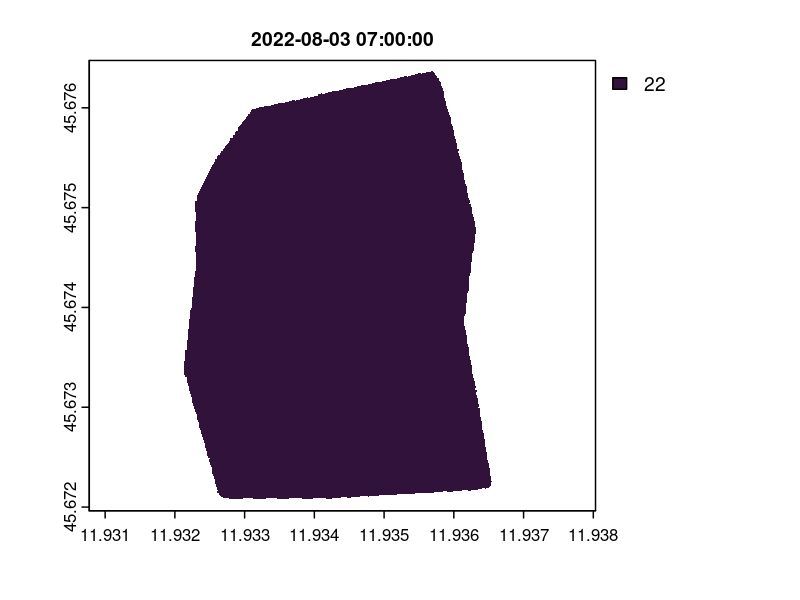

rPET - Physiological Equivalent Temperature
================

- <a href="#usage" id="toc-usage">Usage</a>
- <a href="#mapping-confort-values"
  id="toc-mapping-confort-values">Mapping confort values</a>
- <a href="#installation" id="toc-installation">Installation</a>
- <a href="#references" id="toc-references">References</a>
- <a href="#acknowledgements"
  id="toc-acknowledgements">Acknowledgements</a>

<!-- README.md is generated from README.Rmd. Please edit that file -->
<!-- badges: start -->

[](https://CRAN.R-project.org/package=rPET)
[](https://lifecycle.r-lib.org/articles/stages.html#experimental)
[](https://github.com/fpirotti/rPET/actions)

<!-- badges: end -->

The goal of rPET is to calculate Physiological Equivalent Temperature
(PET) from an R function, allowing to apply the function to vectors and
matrices. For more info see [references section](References):

## Usage

Three air temperatures and wind speeds:

``` r
PETcorrected( Tair = 20, Tmrt=21, v=0, rh=20 )

PETcorrected( Tair = 25, Tmrt=21, v=0.1, rh=20 )

PETcorrected( Tair = 30, Tmrt=21, v_air=0.5, rh=20 )
```

a faster way in vectorized format:

``` r
PETcorrected( Tair = c(20,25,30), Tmrt=21, v_air=c(0, 0.1, 0.5), rh=20 )
```

All possible combinations of three values from four factors:

``` r
values <- expand.grid(
            Tair = c(20,25,30), Tmrt = c(20,25,30),
            wind_speed = c(0, 0.5, 1),
            rh = c(10, 50, 70)
          )

PETs <- PETcorrected( Tair = values$Tair, Tmrt=values$Tmrt, 
              v_air=values$wind_speed, rh=values$rh )
```

Plotting combinations of 10 values from two factors, Air Temperature and
Wind Speed:

``` r
Tair_values <- (1:20)*2
wind_speed_values <- (1:20)/4

values.dry <- expand.grid(
            Tair = Tair_values,  
            windSpeed = wind_speed_values
          )

values.dry$PET <- rPET::PETcorrected( Tair = values.dry$Tair,  
              v_air=values.dry$windSpeed, rh=10 )
 
topo.loess <- loess (PET ~ Tair * windSpeed, values.dry, degree = 2, span = 0.2)
x <- seq (min (values.dry$Tair), max (values.dry$Tair), .05)
y <- seq (min (values.dry$windSpeed), max (values.dry$windSpeed), .05)
interpolated <- predict (topo.loess, expand.grid (Tair = x, windSpeed = y))

image (x= x, y= y, z = interpolated, xlab = "Air Temp. °C", 
     ylab="Wind Speed (m/s)", col=hcl.colors(100, "Temps") )

contour(x, y, interpolated, levels = seq(0, 40, by = 2),
        add = TRUE, col = "brown", labcex=0.8)
title(main = "Estimated PET values ", font.main = 4)
```

<!-- -->

## Mapping confort values

If you have a Digital Terrain Model and a point cloud 3D model in LAS
format, then you can simulate and map PET over the DTM grid values.

<label>Below an animation of mapped comfort index changing over a hot
summer day in Villa Bolasco
<a href="https://www.varcities.eu/" target="_blank">VARCITIES project -
grant agreement n. </a></label>
 Solar illumination is
simulated at points in space using a 3D model in voxel structure and a
ray-casting method.

<video src="https://user-images.githubusercontent.com/1391292/181439231-4d9c09ff-c552-499a-8d95-6ea988079e55.mp4" data-canonical-src="https://user-images.githubusercontent.com/1391292/181439231-4d9c09ff-c552-499a-8d95-6ea988079e55.mp4?width=354&amp;height=488" controls="controls" muted="muted" autoplay style="max-height:640px;">
</video>


<br>**Figure 1.** Example over a UAV lidar flight with 5000 points per
square meter.

## Installation

<!-- **NOT YET AVAILABLE ON CRAN** You can install the released version of
rPET from [CRAN](https://CRAN.R-project.org) with:

``` r
install.packages("rPET")
```
 -->

Not yet available in CRAN: download and install the development version
from [GitHub/fpirotti/rPET](https://github.com/fpirotti/rPET) with:

``` r
# install.packages("devtools")
devtools::install_github("fpirotti/rPET")
```

## References

Pirotti F, Piragnolo M, D’Agostini M, Cavalli R. *Information
Technologies for Real-Time Mapping of Human Well-Being Indicators in an
Urban Historical Garden.* Future Internet. 2022; 14(10):280.
<https://doi.org/10.3390/fi14100280>

Code is adapted from the work below:

E. Walther, Q. Goestchel, *The P.E.T. comfort index: Questioning the
model,* Building and Environment, Volume 137, 2018, Pages 1-10, ISSN
0360-1323, <https://doi.org/10.1016/j.buildenv.2018.03.054>.

For a nice overview of the meaning of PET see also:

Höppe, P. *The physiological equivalent temperature – a universal index
for the biometeorological assessment of the thermal environment*. Int J
Biometeorol 43, 71–75 (1999). <https://doi.org/10.1007/s004840050118>

Mean Radiant Temperature calculations:

Rakha, T., Zhandand Christoph Reinhart, P., 2017. *A Framework for
Outdoor Mean Radiant Temperature Simulation: Towards Spatially Resolved
Thermal Comfort Mapping in Urban Spaces.* Presented at the 2017 Building
Simulation Conference. <https://doi.org/10.26868/25222708.2017.677>

RayShader function for mapping estimated solar radiation values was
taken partly from the work of
<a href="https://github.com/tylermorganwall/rayshader"
target="_blank">tylermorganwal’s rayshader for R</a> and adapted to
point clouds. For more detail on point clouds see [Pirotti et al.,
2022](https://doi.org/10.3390/fi14100280)

## Acknowledgements

<div>

<div style="width: 80px; float:left; height:100px; margin:0px">


</div>

<div
style="width: *; float:left; height:100px; font-size:10px; margin:5px; padding-left: 5px;">

This project has received funding from the European Union’s Horizon 2020
Research and Innovation programme, under grant agreement No 869505.
<br>This page reflect only the authors’ view and the European
Commission/EASME is not responsible for any use that may be made of the
information it contains.

</div>

</div>
