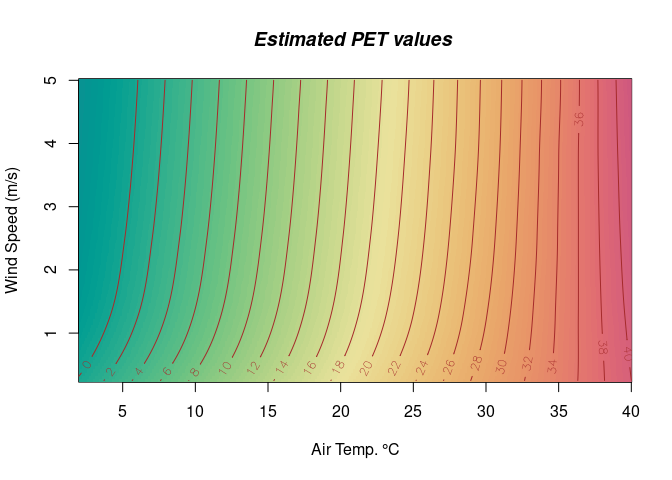

rPET - Physiological Equivalent Temperature
================

- <a href="#usage" id="toc-usage">Usage</a>
- <a href="#mapping-confort-values"
  id="toc-mapping-confort-values">Mapping confort values</a>
- <a href="#installation" id="toc-installation">Installation</a>
- <a href="#references" id="toc-references">References</a>
- <a href="#future-work" id="toc-future-work">Future work</a>
- <a href="#acknowledgements"
  id="toc-acknowledgements">Acknowledgements</a>

<!-- README.md is generated from README.Rmd. Please edit that file -->
<!-- badges: start -->

[](https://CRAN.R-project.org/package=rPET)
[](https://lifecycle.r-lib.org/articles/stages.html#experimental)
[](https://github.com/fpirotti/rPET/actions)

<!-- badges: end -->

The goal of rPET is to calculate Physiological Equivalent Temperature
(PET) using as input measurements from sensors in the field and
information on person position and characteristics. The following input
can be used: - air temperature, - wind speed - sun radiation - relative
humidity - age - clothing - metabolic rate (standing, walking, running
etc..) - weight - height

An important component, mean radiant temperature (Tmrt), is estimated in
this version in a simplified form, i.e. only considering direct and
diffuse sunlight, without other surfaces that could be emitting
long-wave radiation (i.e. heat).

Environmental 3D information can be used as input in the form of a
terrain model (a raster grid) and a 3D point cloud in the form of XYZ
table. These information is used to infer the amount of direct/diffuse
solar radiation reaching a person standing at each node of the raster
grid, therefore providing Tmrt and the final PET value for that node.
For more info see \[1-5\]:

## Usage

Three air temperatures and wind speeds:

``` r
library(rPET)

PETcorrected( Tair = 20, Tmrt=21, v_air =0, rh=20 )
```

    ## [1] 21.49536

``` r
PETcorrected( Tair = 25, Tmrt=21, v_air=0.1, rh=20 )
```

    ## [1] 22.704

``` r
PETcorrected( Tair = 30, Tmrt=21, v_air=0.5, rh=20 )
```

    ## [1] 25.10304

a faster way in vectorized format, like running each row from table
below:

| Tair | Tmrt | v_air | rh  |
|------|------|-------|-----|
| 20   | 30   | 0     | 20  |
| 25   | 30   | 1     | 20  |
| 30   | 30   | 5     | 20  |

``` r
PETcorrected( Tair = c(20,25,30), Tmrt=30, v_air=c(0, 1, 5), rh=20 )
```

    ## [1] 26.82496 24.15802 26.37248

All possible combinations of three values from three factors for a total
of 27 combinations.

``` r
values <- expand.grid(
            Tair = c(20,25,30), Tmrt = 30,
            wind_speed = c(0, 1, 5),
            rh = c(10, 50, 70)
          )

PETs <- PETcorrected( Tair = values$Tair, Tmrt=values$Tmrt, 
              v_air=values$wind_speed, rh=values$rh )
message(PETs)
```

    ## 26.678428.489945630.252620820.4182579224.0566428.233616.7635221.34675226.249627.1897629.09631.0567219220.7174424.61356828.96115216.932454421.5779226.93785627.40620829.36019231.457638420.86668824.80249629.32569617.017621.69491227.37792

Plotting combinations of 10 values from two factors, Air Temperature and
Wind Speed:

``` r
Tair_values <- (1:20)*2
wind_speed_values <- (1:20)/4

values.dry <- expand.grid(
            Tair = Tair_values,  
            windSpeed = wind_speed_values
          )

values.dry$PET <- rPET::PETcorrected( Tair = values.dry$Tair,
                                      Tmrt = values.dry$Tair,  
                                      v_air=values.dry$windSpeed, 
                                      rh=10 )
 
topo.loess <- loess (PET ~ Tair * windSpeed, values.dry, degree = 2, span = 0.2)
x <- seq (min (values.dry$Tair), max (values.dry$Tair), .05)
y <- seq (min (values.dry$windSpeed), max (values.dry$windSpeed), .05)
interpolated <- predict (topo.loess, expand.grid (Tair = x, windSpeed = y))

image (x= x, y= y, z = interpolated, xlab = "Air Temp. °C", 
     ylab="Wind Speed (m/s)", col=hcl.colors(100, "Temps") )

contour(x, y, interpolated, levels = seq(0, 40, by = 2),
        add = TRUE, col = "brown", labcex=0.8)
title(main = "Estimated PET values ", font.main = 4)
```

<!-- -->

## Mapping confort values

If you have a Digital Terrain Model and a point cloud 3D model as XYZ
format format, then you can simulate and map PET over the DTM grid
nodes, simulating PET at the position of each node.

NB: what changes is the Mean Radiant Temperature, which is estimated by
using 3D data.

``` r
## The LAS/LAZ file where the XYZ points are read
# las.file <- "data-raw/voxel_villabolasco_light.laz"
# dtm.file <- "data-raw/bolasco_DTM_1m.tif"
## reading  data from the LAS/LAZ file
# xyz<-  lidR::readLAS(las.file, select = "XYZ")
## convert LAS data to XYZ table
# PointCloud3D<-xyz@data
## reading DTM
# heightraster <- terra::rast(dtm.file)


## In this example we will use embedded data in the GitHub page
## of the package.
e<-environment(rPET::prepareData)
if(is.null(e$dataenv) ||
   !is.data.frame(e$dataenv$pointcloud)||
   !inherits(e$dataenv$dtm, "PackedSpatRaster") ){
  ret<-rPET::prepareData()
  if(!ret) {
    warning("Could not download data!")
    }
}
## Grab the point cloud from the environment
PointCloud3D<-e$dataenv$pointcloud
heightraster<- terra::unwrap(e$dataenv$dtm)

sunangle = 135 # South East direction of azimuth in degrees
sunaltitude = 45 # 45° from the horizon 
##calculate the direct/diffuse fraction using dithered shade
## fraction
 
rs <- rPET::ray_shade(heightraster, 
                      PointCloud3D, 
                      sunangle = sunangle,
                      zscale = 1,   
                      sunaltitude =  sunaltitude, 
                      makeVoxelGrid = FALSE, progbar = FALSE,
                      lambert = TRUE)

# rs %>% rayshader::plot_map()
## convert matrix to a terra raster object
rast.shade <- rPET::matrix2raster(rs) 
## get non-NA cells' ids 
cell.ids <-terra::cells(rast.shade)
## get non-NA cell values 
values<-  terra::values(rast.shade, na.rm=TRUE)

## to drastically increase speed, we classify 
## direct/diffuse fraction in 100 maximum classes
## from 0 to 1 by 0.01 steps  
dvalues <- round(values[,1], 2)
udvalues <- unique(dvalues)
## we estimate the mean radiant temperature for the possible
## fraction categories
mrtv <- mrt(air_temperature = 30, 
            sunaltitude = sunaltitude, 
            solar_radiation_wm2 = 100, 
            Fd = udvalues)

## we estimate the PET for the fraction categories
pet.low.wind <- rPET::PETcorrected(Tair = 30, Tmrt =mrtv,
                         v_air = 0.1, rh = 50 )
## moderate wind 15 km/h -
pet.med.wind <- rPET::PETcorrected(Tair = 30, Tmrt =mrtv,
                         v_air = 4, rh = 50 )
## we map pet values to all non-NA pixels
all.pet.values.low <- pet.low.wind[ match(dvalues, udvalues) ]
all.pet.values.med <- pet.med.wind[ match(dvalues, udvalues) ]
petraster <- c(heightraster, heightraster)
names(petraster) <- c("low", "med")
## we assign PET values to cells in the heightraster
petraster$low[cell.ids] <- all.pet.values.low
petraster$med[cell.ids] <- all.pet.values.med
range <-   quantile(petraster[], c(0.1,0.9), na.rm=TRUE)
# petraster <- terra::clamp(petraster, lower=range[[1]], upper=range[[2]])
terra::plot(petraster, col=viridis::turbo(12), 
            main=c("PET 0.1 m/s wind", "PET 5 m/s wind") )
title( "30 °C - 50% RH ", cex.main = 1.2,   outer=F )
```

<label>Below an animation of mapped comfort index changing over a hot
summer day in Villa Bolasco. 
Solar illumination is simulated at points in space using a 3D model in
voxel structure and a ray-casting method.

<video src="https://user-images.githubusercontent.com/1391292/181439231-4d9c09ff-c552-499a-8d95-6ea988079e55.mp4" data-canonical-src="https://user-images.githubusercontent.com/1391292/181439231-4d9c09ff-c552-499a-8d95-6ea988079e55.mp4?width=354&amp;height=488" controls="controls" muted="muted" autoplay style="max-height:640px;">
</video>


<br>**Figure 1.** Example over a UAV lidar flight with 5000 points per
square meter.

## Installation

<!-- **NOT YET AVAILABLE ON CRAN** You can install the released version of
rPET from [CRAN](https://CRAN.R-project.org) with:

``` r
install.packages("rPET")
```
 -->

Not yet available in CRAN: download and install the development version
from [GitHub/fpirotti/rPET](https://github.com/fpirotti/rPET) with:

``` r
# install.packages("devtools")
devtools::install_github("fpirotti/rPET")
```

## References

1.  Pirotti F, Piragnolo M, D’Agostini M, Cavalli R. *Information
    Technologies for Real-Time Mapping of Human Well-Being Indicators in
    an Urban Historical Garden.* Future Internet. 2022; 14(10):280.
    <https://doi.org/10.3390/fi14100280>

2.  E. Walther, Q. Goestchel, *The P.E.T. comfort index: Questioning the
    model,* Building and Environment, Volume 137, 2018, Pages 1-10, ISSN
    0360-1323, <https://doi.org/10.1016/j.buildenv.2018.03.054>.

3.  Höppe, P. *The physiological equivalent temperature – a universal
    index for the biometeorological assessment of the thermal
    environment*. Int J Biometeorol 43, 71–75 (1999).
    <https://doi.org/10.1007/s004840050118>

4.  Rakha, T., Zhandand Christoph Reinhart, P., 2017. *A Framework for
    Outdoor Mean Radiant Temperature Simulation: Towards Spatially
    Resolved Thermal Comfort Mapping in Urban Spaces.* Presented at the
    2017 Building Simulation Conference.
    <https://doi.org/10.26868/25222708.2017.677>

5.  Csilla V. Gál, Noémi Kántor, Modeling mean radiant temperature in
    outdoor spaces, A comparative numerical  
    simulation and validation study, Urban Climate, Volume 32, 2020,
    100571, <https://doi.org/10.1016/j.uclim.2019.100571>.

6.  Morgan-Wall, T., 2023. rayshader: Create Maps and Visualize Data in
    2D and 3D. RayShader function for mapping estimated solar radiation
    values was taken partly from the work of
    <a href="https://github.com/tylermorganwall/rayshader"
    target="_blank">tylermorganwal’s rayshader for R</a> and adapted to
    point clouds. For more detail on point clouds see [Pirotti et al.,
    2022](https://doi.org/10.3390/fi14100280)

## Future work

Using a classified point cloud (XYZC) with C=class value to calculate a
more sophisticated Tmrt estimation using long-wave radiation emissions
from surfaces.

## Acknowledgements


<div id="euimgdiv">

This project has received funding from the European Union’s Horizon 2020
Research and Innovation programme, under grant agreement No 869505.
<br>This page reflect only the authors’ view and the European
Commission/EASME is not responsible for any use that may be made of the
information it contains.

</div>
